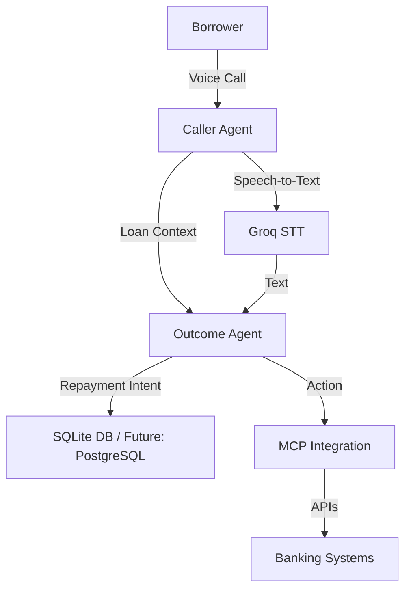

# Loan Collection Agentic VoiceBot

##  Vision
A next-gen **multi-agent, voice-driven debt collection system** that transforms the way financial institutions interact with customers.  
Instead of robotic reminders, our AI VoiceBot leverages **multi-agent collaboration, real-time speech intelligence, and contextual understanding** to create **empathetic, scalable, and effective repayment nudges**.

---

## Challenge Fit (Hackathon Criteria)

- **Multi-Agent Architecture**  
  - Specialized agents: `CallerAgent` (outreach), `OutcomeAgent` (repayment intent tracking), and `MCPIntegration` (external tools).

- **Real-Time Performance** 
  - Powered by **Groq inference** for ultra-low-latency STT + TTS.  
  - Integrated with **Twilio** for instant customer calls.

- **MCP Integration** 
  - Seamlessly connects with external systems via **FastAPI endpoints + Model Context Protocol (MCP)**.

- **Multi-Modal Intelligence**
  - Current: **Voice + Text** (STT + TTS).  
  - Next: add **vision/OCR** for document-based reminders, and **sentiment analysis** for empathy-driven nudges.

- **Genuine Use Case**  
  - Loan repayment collections — a real financial industry problem, **not a contrived demo**.

---

## Architecture


---

## Features
- 📞 **Automated Calls** using Twilio  
- 🗣️ **Speech-to-Text (STT)** with Groq for lightning-fast transcription  
- 🔊 **Text-to-Speech (TTS)** for human-like voice reminders  
- 🧠 **Multi-Agent Flow**: division of responsibility between agents  
- ⚡ **Real-Time Performance** for smooth UX  
- 📊 **Outcome Tracking** stored in DB  
- 🌍 **Deployed on Railway** → accessible live demo  

---

## 🔗 Live Demo
👉 [Click here to try the VoiceBot](loan-collection-agentic-voicebot-production.up.railway.app)  

---

## Tech Stack
- **LangChain** (multi-agent orchestration)  
- **Groq** (ultra-low-latency inference)  
- **Twilio** (voice calling API)  
- **FastAPI** (backend + MCP endpoints)  
- **SQLite** (lightweight DB, future-ready for PostgreSQL/NoSQL)  
- **Railway** (cloud deployment)  

---

## Future Enhancements
- Add **Sentiment & Emotion Analysis** for empathy-driven conversations  
- Expand **Modalities** (OCR for documents, WhatsApp/SMS integration)  
- Shift DB to **PostgreSQL** for scalability  
- Introduce **Analytics Dashboard** for collection performance metrics  
- Personalization engine → repayment nudges tailored to borrower profile  

---

## Hackathon Edge
This project is not “just another bot” — it’s a **scalable, real-world financial AI system** with:  
- Multi-agent synergy  
- Real-time low-latency interactions  
- Enterprise integration readiness  
- A genuine, high-impact use case  

---

## ⚙️ Setup Instructions

```bash
# Clone the repo
git clone https://github.com/AgrimGupta04/Loan-Collection-Agentic-VoiceBot
cd Loan-Collection-Agentic-VoiceBot

# Create virtual environment
python -m venv venv
source venv/bin/activate  # or venv\Scripts\activate on Windows

# Install dependencies
pip install -r requirements.txt

# Run FastAPI backend
uvicorn app:app --reload

# For local testing 
python main.py
```

---

## Contributors
- **Agrim Gupta** – AI Engineer & Project Lead  

---

## 📜 License
MIT License. Free to use and extend.
